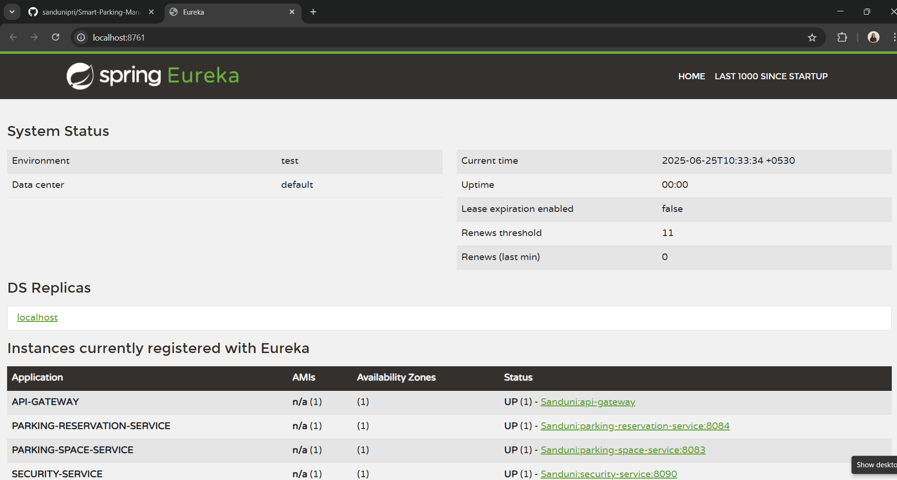

# Smart Parking Management System

This is a microservices-based Smart Parking Management System developed using Spring Boot and Spring Cloud. The system manages user authentication, parking space availability, and parking reservations. It includes a service discovery mechanism through Eureka and an API Gateway for centralized routing.

## Project Structure

- `eureka-server/` – Eureka service registry
- `config-server/` – Centralized configuration service
- `security-service/` – Manages authentication and authorization (JWT-based)
- `api-gateway/` – Central gateway for routing and securing API requests
- `user-service/` – Manages user registration, authentication, and user roles
- `vehicle-service/` – Manages vehicle records associated with registered users
- `parking-space-service/` – Manages available parking slots and their details
- `parking-reservation-service/` – Handles parking reservations, active sessions, and history
- `docs/screenshots/` – Screenshots and documentation assets

## Technologies Used

- Java 17
- Spring Boot
- Spring Cloud (Eureka, Config Server, OpenFeign)
- Spring Security with JWT
- MySQL
- API Gateway
- Postman
- Maven
- Git, GitHub

## Resources

- [Postman Collection](./smart-parking-system.postman_collection.json)

##  Eureka Dashboard
  
- 
- [Eureka Dashboard](./docs/screenshots/eureka_dashboard-02.png)  

 
## How to Run the Project

1. Clone the repository:
   ```bash
   git clone [https://github.com/sandunipri/Smart-Parking-Management-System.git]
   cd Smart-Parking-Management-System

