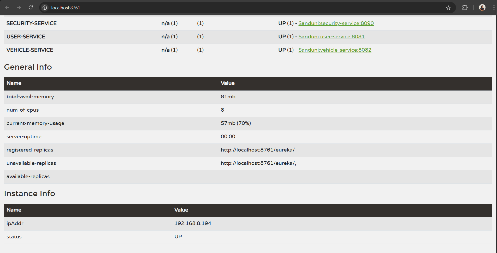

# Smart Parking Management System

This is a microservices-based Smart Parking Management System developed using Spring Boot and Spring Cloud. The system manages user authentication, parking space availability, vehicle records, and parking reservations. It uses Eureka for service discovery and an API Gateway for centralized routing and security enforcement.

## Project Structure

- `eureka-server/` – Eureka service registry
- `config-server/` – Centralized configuration service
- `security-service/` – Manages authentication and authorization (JWT-based)
- `api-gateway/` – Central gateway for routing and securing API requests
- `user-service/` – Manages user registration, authentication, and user roles
- `vehicle-service/` – Manages vehicle records associated with registered users
- `parking-space-service/` – Manages available parking slots and related information
- `parking-reservation-service/` – Handles parking reservations, active sessions, and reservation history
- `docs/screenshots/` – Contains documentation assets and screenshots

## Technologies Used

- Java 17
- Spring Boot
- Spring Cloud (Eureka, Config Server, OpenFeign)
- Spring Security with JWT
- MySQL
- API Gateway
- Postman
- Maven
- Git, GitHub

## Configuration Management

This project uses centralized configuration management via **Spring Cloud Config Server**. All service configurations are maintained in a separate Git-based repository:

- Repository Name: `SPMS-config-repo`
- Repository Link:
  ```bash
  git clone https://github.com/sandunipri/SPMS-Config-Repo.git
  
Each microservice retrieves its configuration at startup from this external repository.

## Resources

- [Postman Collection](./smart-parking-system.postman_collection.json)

## Eureka Dashboard

- 
- 

## How to Run the Project

1. Clone the repository:
   ```bash
   git clone https://github.com/sandunipri/Smart-Parking-Management-System.git
   cd Smart-Parking-Management-System


